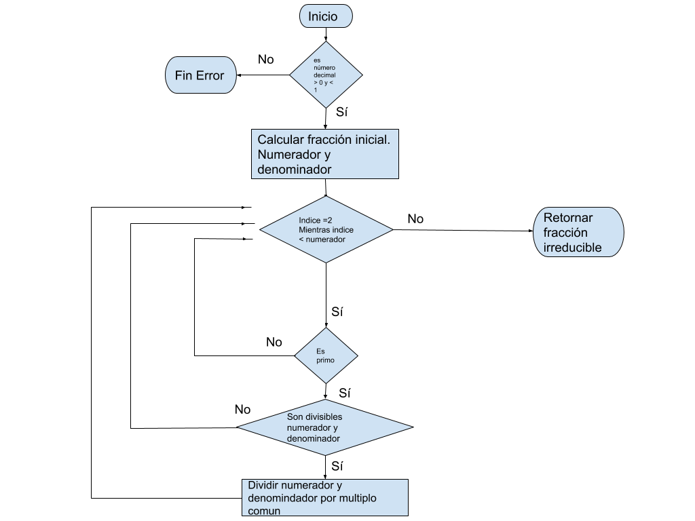

# Tarea_21 Fracción irreducible

Un programa que dado un número introducido entre 0,0001 y 0,9999 (no más de 4 cifras decimales),
obtenga y muestre la correspondiente fracción irreducible.
Por ejemplo, el número 0,25 se puede obtener a partir de 25/100, o de 2/8, o de 1/4, entre otros. La
fracción irreducible es 1/4, que está formada por un numerador y un denominador que son primos entre
sí.

# Solución

Primero se multiplica el valor de entrada por 10000, para lograr así su representacion con forma de numerador y denominador. 
El numerador será valor_introducido*10000 y el denominador será 10000.

Ahora debemos buscar valores por los cuales es divisible tanto el numerador como el denominador. Para eso hacemos un bucle que recorre los numeros desde el 2 hasta el numerador. Y vamos buscando los numero primos entre los que son divisibles ambos, y en tal caso los dividimos, tantas veces como se pueda. Cuando ya no se puede dividir más es que ya no es reducible, y hemos logrado la fracción irreducible.

 

# Ejecución

El programa se ha hecho usando python 3.8

Para ejecutarlo, se requiere tener python instalado. Abrir una consola, ir a la carpeta donde está el archivo .py
Y ejecutar >fraccion_irreducible.py

Se debe introducir un valor decimal entre 0.0001 y 0.9999 y pulsar enter
Se devuelve por pantalla la fracción irreducible en forma de numerador / denominador.
