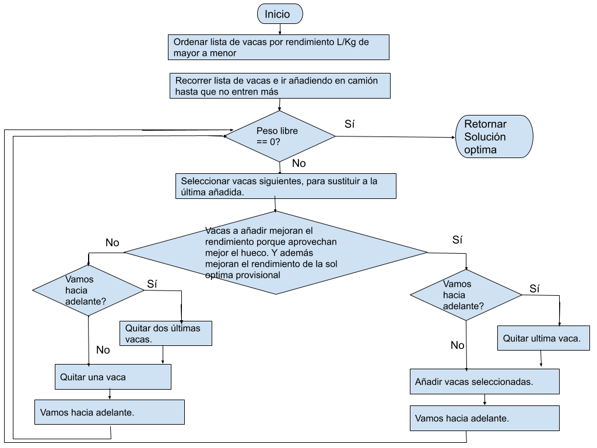

# Tarea_22 Algoritmo del lechero

Usted es un original empresario de Azkoitia, y tiene la brillante idea de abrir una tienda de la leche en la Plaza del pueblo. Como es una persona muy prudente, desea que la leche que venderá sea perfectamente natural y fresca, y por esa razón, va a traer unas sanísimas vacas de desde Tolosa.  
Dispone de un camión con un cierto límite de peso, y un grupo de vacas disponibles para la venta. Cada vaca puede tener un peso distinto, y producir una cantidad diferente de leche al día.  
Debes elegir qué vacas comprar y llevar en su camión, de modo que pueda maximizar la producción de leche, observando el límite de peso del camión.  

1.- Para este propósito tienes que definir las siguientes entradas:  
Entrada: Número total de vacas en la zona de Tolosa que están a la venta.  
Entrada: Peso total que el camión puede llevar.  
Entrada: Lista de pesos de las vacas.  
Entrada: Lista de la producción de leche por vaca, en litros por día.  
2.- El algoritmo que programes tiene que calcular la siguiente salida:  
Salida: Cantidad máxima de producción de leche se puede obtener.  
Fuente: http://www.nachocabanes.com/retos/reto.php?n=07  

# Solución

TODO

 

# Ejecución

El programa se ha hecho usando python 3.8  
  
Para ejecutarlo, se requiere tener python instalado. Abrir una consola, ir a la carpeta donde está el archivo .py  
Y ejecutar >algoritm_lechero.py  

Se debe introducir un path a un fichero CSV con la lista de vacas, en la que por cada vaca tenga la siguiente info: id de vaca, peso y litros por día. Ver ejemplos en carpeta /config.
Peso que soporta el camión.
Número de vacas
Se devuelve por pantalla la solución optima, con la lista de vacas metidas en el camión para oobtener el máximo número de litros.
