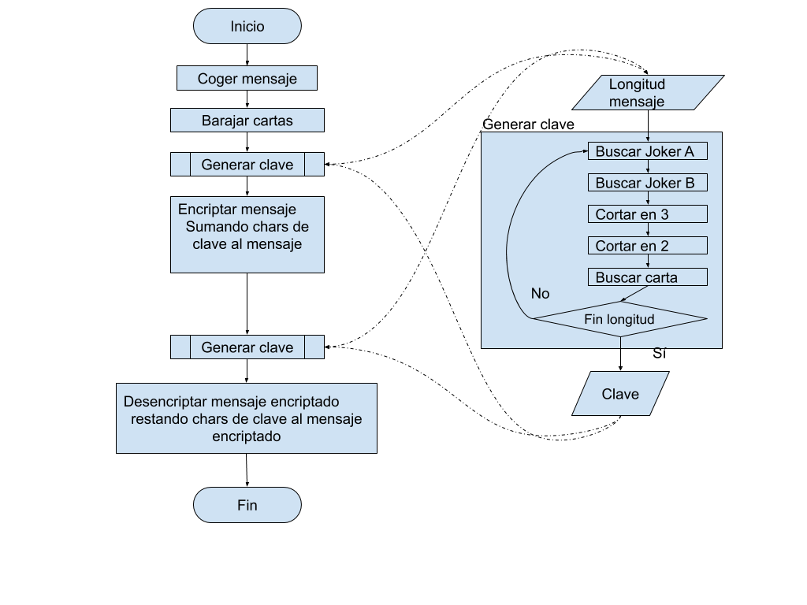

# Tarea_23 Solitario

Pues bien, en la siguiente tarea, el alumno debe construir una comunicación cifrada entre dos funciones utilizando el algoritmo del solitario:  
1.- Una primera función a la que enviemos una variable (que será una frase o cadena e texto) para que la función lo cifre mediante el solitario. En programación existen diferentes tipos de variables: strings, enteros, flotantes, booleanos, ... y en este caso la variable o parámetro que se le envía a la función es de tipo String.  
2.- Una segunda función que recoja el mensaje cifrado y lo descifre utilizando este mismo algoritmo.  

Fuente: https://sindominio.net/biblioweb/telematica/solitario.html  

# Solución

Para implementar las funciones de encriptación y desencriptación, se siguen los pasos descritos en la web de referencia en la descripción del problema.  

Se hace una función auxiliar para generar la clave, que a su vez va llamando ciclicamente a otra función que genera un char de la clave.  

Una vez tenemos la clave, encriptamos el mensaje sumándole la clave y a continuación lo desencriptamos restándosela.  

 

# Ejecución

El programa se ha hecho usando python 3.8  
  
Para ejecutarlo, se requiere tener python instalado. Abrir una consola, ir a la carpeta donde está el archivo .py  
Y ejecutar >solitario.py  

Se debe introducir el mensaje de texto a cifrar.  
Y se devuelve el mensaje cifrado y descifrado. Éste último debe coincidir con el mensaje de entrada.  
