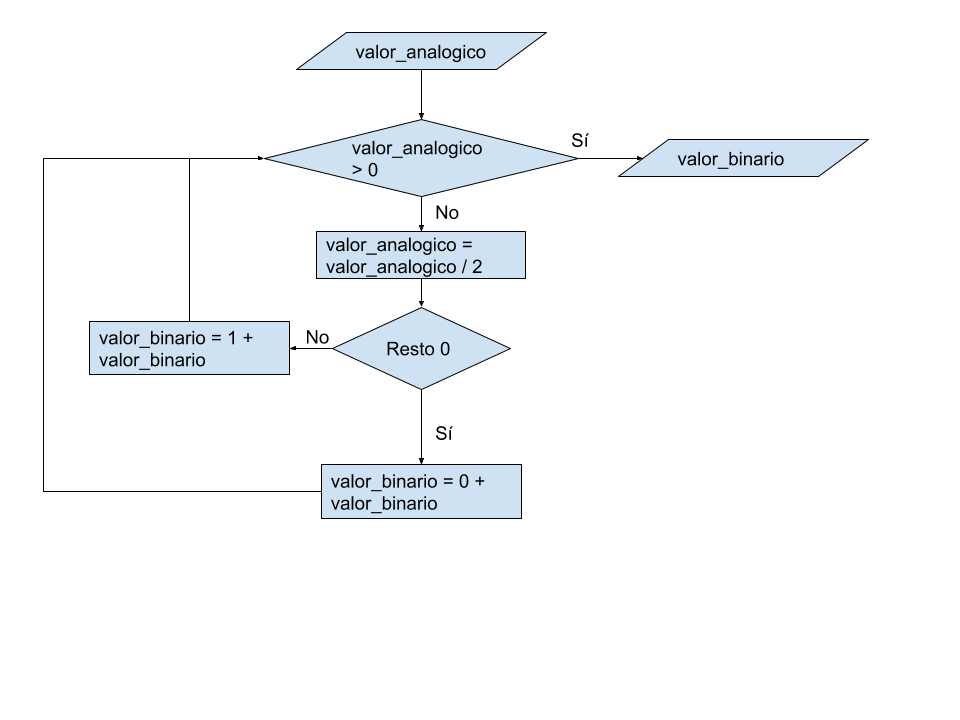

# Tarea_24 Convertidor analógico digital

En este caso hay que desarrollar un programa donde una vez enviado un valor decimal a una función este lo convierta a binario y nos lo devuelva.  
Se trata de construir un simulador de un convertidor analógico digital mediante un programa (software). El hardware lo dejamos para otro día.  

# Solución

Para implementar la función de converión analogico a digital, se va dividiendo el valor analógico entre 2, ciclicamente hasta llegar a 0.  
Si el resto de cada división es 1 se añade un 1 a la izquierda al valor binario. Si el resto es 0, se le añade un 0.  

  

# Ejecución

El programa se ha hecho usando python 3.8  
  
Para ejecutarlo, se requiere tener python instalado. Abrir una consola, ir a la carpeta donde está el archivo .py  
Y ejecutar >analogico_digital.py  

Se debe introducir un valor decimal positivo.  
Y se devuelve el valor de entrada convertido en binario.  
