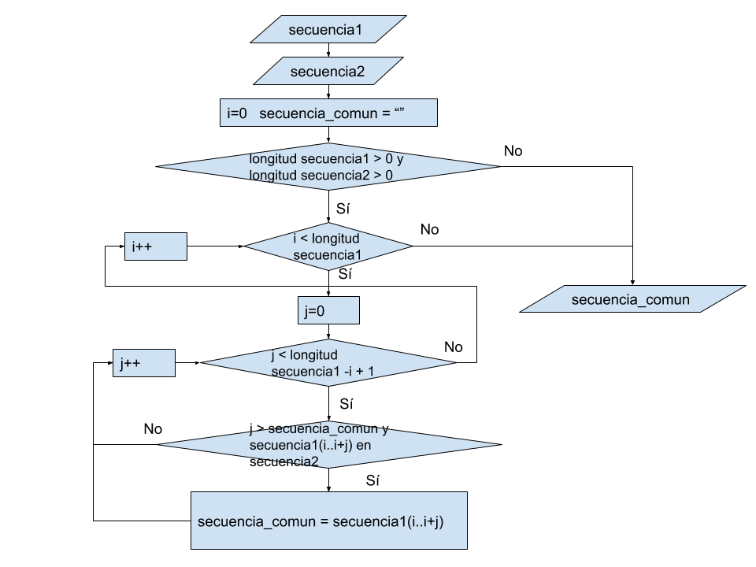
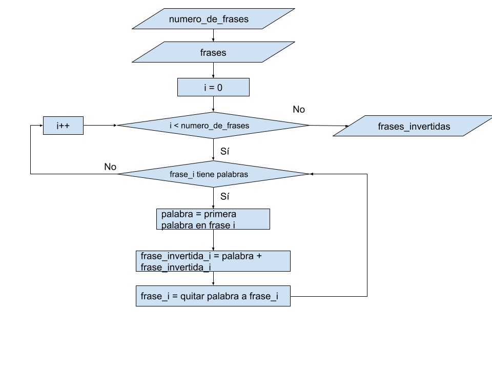
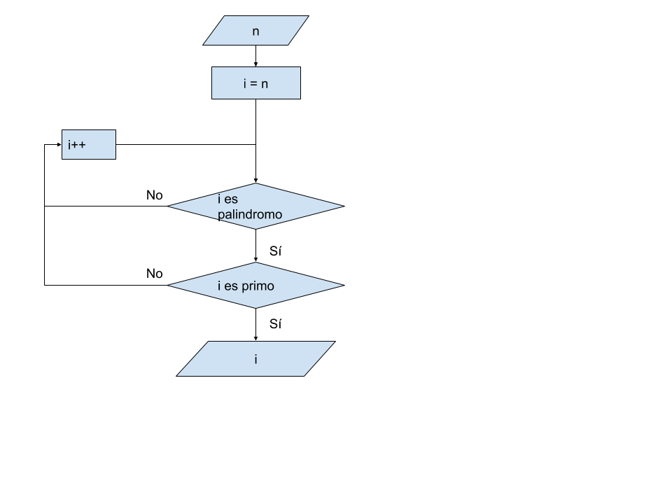

# Tarea_38 

# Biologo

Eres un biólogo que examina secuencias de ADN de formas de vida diferentes. Se te darán dos secuencias de ADN, y el objetivo es encontrar el conjunto ordenado de bases adyacentes de mayor tamaño que es común en ambos ADNs.  
Las secuencias de ADN se darán como conjuntos ordenados de bases de nucleótidos: adenina (abreviado A), citosina (C), guanina (G) y timina (T):  
ATGTCTTCCTCGA TGCTTCCTATGAC  
Para el ejemplo anterior, el resultado es CTTCCT porque que es el conjunto ordenado de bases adyacentes de mayor tamaño que se encuentra en ambas formas de vida.  

# Solución

Se van recorriendo todas la posibilidades de substrings de la secuencia1, y se mira si es parte de la secuencia2. Nos vamos quedando con el substring más grande que si es parte de la 2.
  

# Ejecución

El programa se ha hecho usando python 3.8  
  
Para ejecutarlo, se requiere tener python instalado. Abrir una consola, ir a la carpeta donde está el archivo .py  
Y ejecutar >biologo.py  
E introducir las dos secuencias separadas por enter.  

# Invertir palabras

Dada una serie de palabras separadas por espacios, escribir la frase formada por las mismas palabras en orden inverso. Cada palabra estará formada exclusivamente por letras, y existirá exactamente un espacio entre cada pareja de palabras. La salida debe ser "Case #" seguido del número de caso, de un símbolo de "dos puntos", de un espacio en blanco y de la frase invertida.

# Solución

Se va recorriendo cada frase de izquierda a derecha, buscando palabras. Y se van asignando esas palabras a la frase invertida, concatenando por delante.  
  

# Ejecución

El programa se ha hecho usando python 3.8  
  
Para ejecutarlo, se requiere tener python instalado. Abrir una consola, ir a la carpeta donde está el archivo .py  
Y ejecutar >invertir_palabras.py  
E introducir el número de frases, y cada frase, separados por enter.  

# Palindromo primo

Un entero se dice que es un palíndromo si es igual al número que se obtiene al invertir el orden de sus cifras. Por ejemplo, 79197 y 324423 son palíndromos. En esta tarea se le dará un entero N, 1 <= N <= 1.000.000. Usted debe encontrar el menor entero M tal que M >= N que es primo y M es un palíndromo N.

Por ejemplo, si N es 31, entonces la respuesta es 101.

Formato de entrada:
Un solo entero N, (1 <= N <= 1.000.000), en una sola línea.

Formato de salida:
Su salida debe consistir en un solo número entero, el más pequeño palíndromo primo mayor que o igual a N

# Solución

Se van recorriendo números de N en adelante. Y por cada uno se mira si es palindromo, y después si es primo. Se mira primero si es palindromo, porque es más rápido que mirar si es primo.  
Si es palíndromo y primo, se devuelve ese número, y se termina el programa.  
  

# Ejecución

El programa se ha hecho usando python 3.8  
  
Para ejecutarlo, se requiere tener python instalado. Abrir una consola, ir a la carpeta donde está el archivo .py  
Y ejecutar >palindromo_primo.py  
E introducir un número de 1 a 1000000.  
